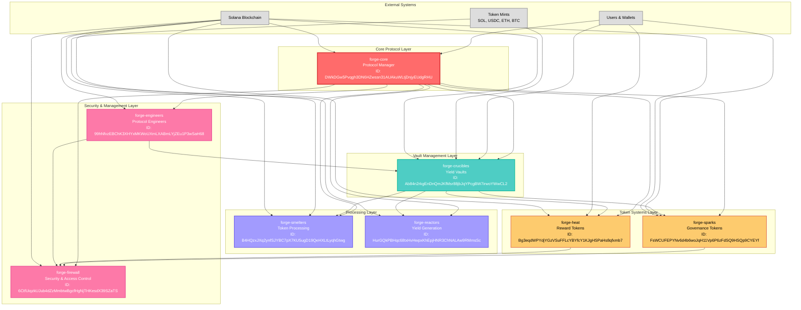

# Forge Finance - Smart Contracts Architecture

## Overview
Forge Finance is a modular DeFi protocol built on Solana with 8 interconnected smart contracts that work together to provide yield farming, governance, and reward mechanisms.

## Architecture Diagram

## Smart Contract Details

### 1. **forge-core** - Protocol Manager
- **Purpose**: Central protocol configuration and management
- **Key Functions**:
  - Initialize protocol with all module program IDs
  - Update protocol configuration
  - Manage protocol fees and limits
  - Track total protocol statistics
- **Program ID**: `DWkDGw5Pvqgh3DN6HZwssn31AUAkuWLtjDnjyEUdgRHU`

### 2. **forge-crucibles** - Yield Vaults
- **Purpose**: Manage yield farming vaults (crucibles) for different tokens
- **Key Functions**:
  - Initialize crucibles for specific tokens
  - Handle deposits and withdrawals
  - Mint SPARK tokens for governance
  - Distribute HEAT rewards
  - Manage user positions and shares
- **Program ID**: `Ab84n2rkgEnDnQmJKfMsr88jbJqYPcgBW7irwoYWwCL2`

### 3. **forge-sparks** - Governance Tokens
- **Purpose**: Manage SPARK tokens for protocol governance
- **Key Functions**:
  - Initialize SPARK token mints
  - Handle SPARK transfers and burns
  - Manage voting power calculations
  - Track governance participation
- **Program ID**: `FsWCUFEPYNv6d4b6woJqH11Vp6P6zFdSQ9HSQp9CYEYf`

### 4. **forge-heat** - Reward Tokens
- **Purpose**: Manage HEAT tokens for user rewards
- **Key Functions**:
  - Initialize heat reward systems
  - Calculate and distribute rewards
  - Handle reward claims
  - Manage emission rates
- **Program ID**: `Bg3eqdWPYdjYGzVSuFFLcYBYfcY1KJgHSPaHs8qfxmb7`

### 5. **forge-smelters** - Token Processing
- **Purpose**: Process and transform tokens within the protocol
- **Key Functions**:
  - Token swaps and conversions
  - Liquidity provision
  - Token aggregation
  - Cross-crucible operations
- **Program ID**: `B4HQzxJXq2ynfSJYBC7pX7KU5ugD19QeHXLtLyqhGtwg`

### 6. **forge-reactors** - Yield Generation
- **Purpose**: Generate yield through various DeFi strategies
- **Key Functions**:
  - Implement yield farming strategies
  - Manage liquidity pools
  - Calculate and distribute yields
  - Optimize returns
- **Program ID**: `HurGQkPBHqc68txHvHwpxKhEpjHNR3ChNALAw9RMmsSc`

### 7. **forge-firewall** - Security & Access Control
- **Purpose**: Provide security and access control mechanisms
- **Key Functions**:
  - Access control and permissions
  - Security checks and validations
  - Rate limiting and anti-abuse
  - Emergency pause mechanisms
- **Program ID**: `6CtfUiqzkUJub4dZzMmbtwBgcfHgNjTHKesdX39SZaTS`

### 8. **forge-engineers** - Protocol Engineers
- **Purpose**: Manage protocol engineers and their permissions
- **Key Functions**:
  - Engineer registration and management
  - Permission management
  - Crucible creation rights
  - Protocol maintenance
- **Program ID**: `99hNfvzEBChK3XHYxMKWoUXmLXABmLYjZEu1P3wSaH68`

## Data Flow

1. **User Interaction**: Users interact with the protocol through the core contract
2. **Crucible Management**: Core delegates crucible operations to forge-crucibles
3. **Token Operations**: Crucibles interact with SPARK and HEAT systems
4. **Processing**: Tokens are processed through smelters and reactors
5. **Security**: All operations are validated through the firewall
6. **Management**: Engineers manage and maintain the protocol

## Key Features

- **Modular Design**: Each contract has a specific purpose and can be upgraded independently
- **Governance**: SPARK tokens provide voting power for protocol decisions
- **Rewards**: HEAT tokens incentivize user participation
- **Security**: Multi-layer security through firewall and access controls
- **Scalability**: Designed to handle multiple crucibles and token types
- **Upgradeability**: Protocol can be upgraded through governance

## Network Configuration

- **Network**: Solana Devnet/Testnet
- **RPC URL**: `https://api.devnet.solana.com`
- **Explorer**: `https://explorer.solana.com`
- **Cluster**: `devnet`

This architecture provides a robust, scalable, and secure foundation for the Forge Finance DeFi protocol on Solana.
